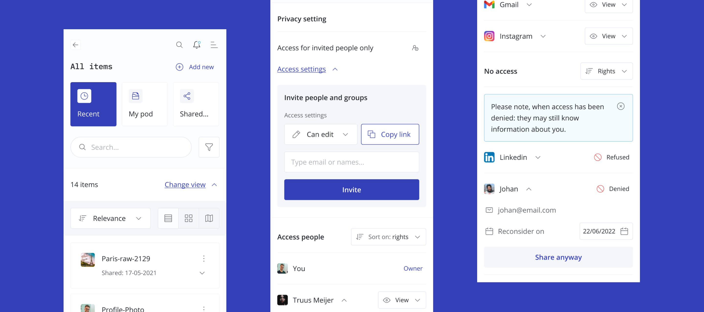

# solid-ui-designs

A complete and open source set of UI + UX designs for personal online datastores.
Designed with the philosophy of linked data, data ownership and the Solid specification in mind.

- [View the style book](https://zeroheight.com/756e7c07f/p/919ed8-solid-ui-kit) on zeroheight
- [Open the UX mockup demo](https://www.figma.com/proto/wkc2XEA6Lddai8n4PUU83C/Solidstarter-Prototype?page-id=327%3A0&node-id=335%3A32985&viewport=289%2C241%2C0.04754795879125595&scaling=scale-down) on figma. You are also free to view and edit the included [`solid-ui.fig`](solid-ui.fig) file
- [Read the blogpost](https://ontola.io/blog/ui-for-pods/)

## Credits

- Design by [Jager & Prooi](https://jagerenprooi.nl/) (UX by [Lara Vaneman](https://www.linkedin.com/in/laravaneman/), UI by [Shelly Stoop](https://www.linkedin.com/in/shellystoop/))
- Concept by [Ontola.io](https://ontola.io/)
- Funded by [SIDN Fonds](https://www.sidnfonds.nl/nieuws/open-call-techneut-zoekt-ontwerper)
- Special thanks to all those who provided inpsiration [and new ideas]

## License

CC-BY or MIT: Ontola.io + Jager & Prooi, 2021

